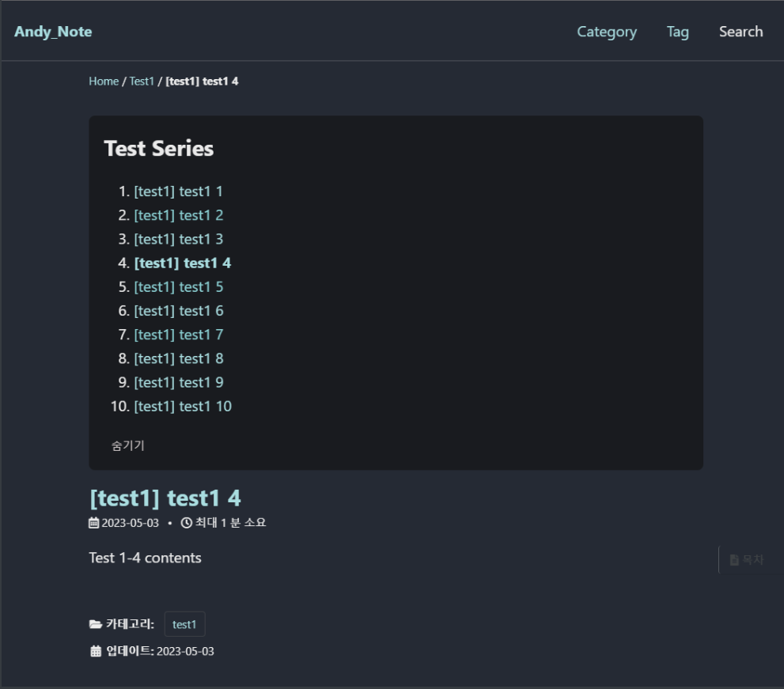
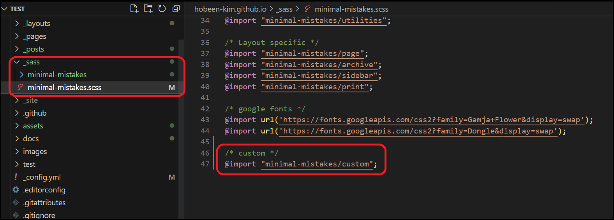
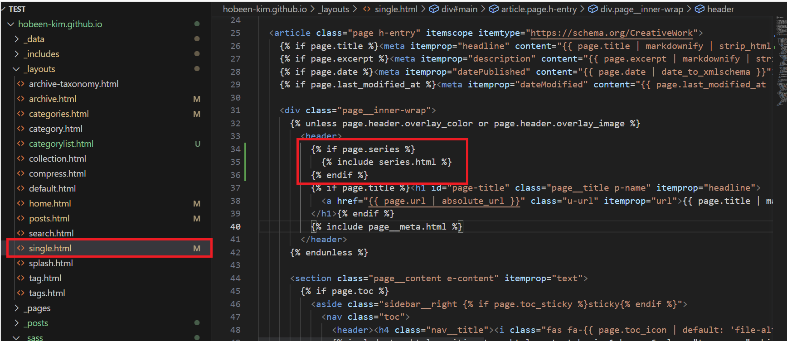
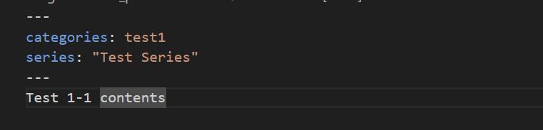

# minimal-mistakes-series

Velog 에서 자주 보이는 시리즈입니다. 

카테고리가 비슷한 역할을 하지만, 카테고리 내에서도 1, 2편 등 나눠지는 시리즈를 묶기 위해서 구현했습니다.

# 적용한 모습

​	테스트 모습입니다.



# 적용 방법

## 파일 다운로드

1. 해당 저장소의 `series` 디렉토리에서 `series.html` 파일을 다운로드 받아서 `_layout` 디렉토리에 넣어줍니다.
2. 해당 저장소의 `series` 디렉토리에서 `custom.js` 파일을 다운로드 받아서 `assets/js` 디렉토리에 넣어줍니다.
3. 해당 저장소의 `series` 디렉토리에서 `_custom.scss` 파일을 다운로드 받아서 `_sass/minimal-mistakes` 디렉토리에 넣어줍니다.

## scss 파일 연결

`_custom.scss` 를 사용하기 위해서 `_sass/minimal-mistakes.scss` 에 `@import "minimal-mistakes/custom"` 을 넣어줍니다.



##  series.html 파일 연결

1. `_layout` 디렉토리의 `single.html` 파일을 엽니다.
2. `<header>` 바로 밑에 아래와 같이 넣어줍니다.

```

	

```



**해당 위치는 제목 바로 위입니다. 기호에 따라 위치를 변경할 수 있습니다.**

## custom.js 파일 연결


`_layouts/default.html` 에 `custom.js` 파일을 사용할 수 있도록 `<script src="../../assets/js/custom.js"></script>` 을 넣어줍니다.

# 사용 방법

​	front matter 에 series 를 추가해줍니다. 같은 시리즈끼리 시리즈 드롭다운을 만듭니다. 대소문자는 구분해야 합니다.



# 기능 명세

- series 별로 시리즈 드롭다운을 만듭니다.
- front matter 에 series 가 없다면 시리즈 드롭다운을 만들지 않습니다.
- 날짜가 빠른 순부터 1번으로 시작합니다. 날짜가 같다면 사전 순서입니다.

- '목록보기' 를 누르면 목록이 보여지며 '목록보기' 가 '숨기기' 로 변경됩니다.
- '목록보기' 를 누르면 목록이 숨겨지며 '숨기기' 가 '목록보기' 로 변경됩니다.

- 시리즈 목록 중 현재 위치가 굵게 표시됩니다.

# Release Note

- v 1.0 2023.06.15 
- v 1.0.1 2023.06.17 - 시리즈 높이 및 보기 & 숨기기 속도를 개수에 맞게 동적으로 조정(js, scss 수정)
- v 1.0.2 2023.06.18 - a 태그 수정 (html, scss 수정)
